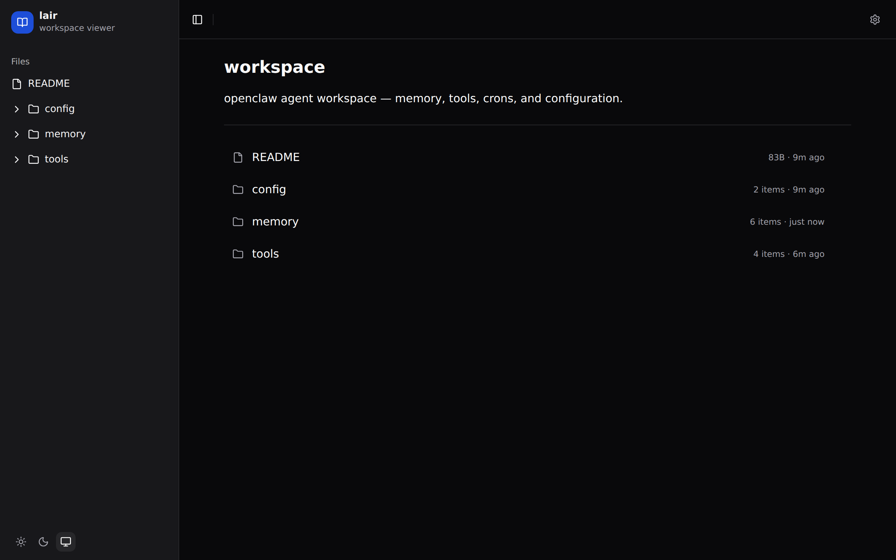
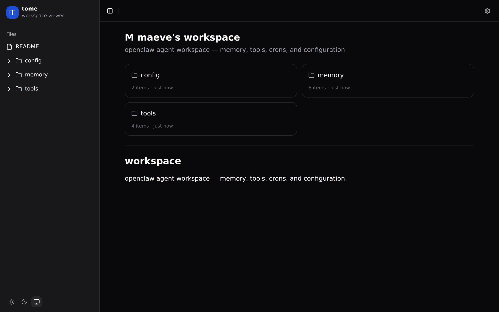
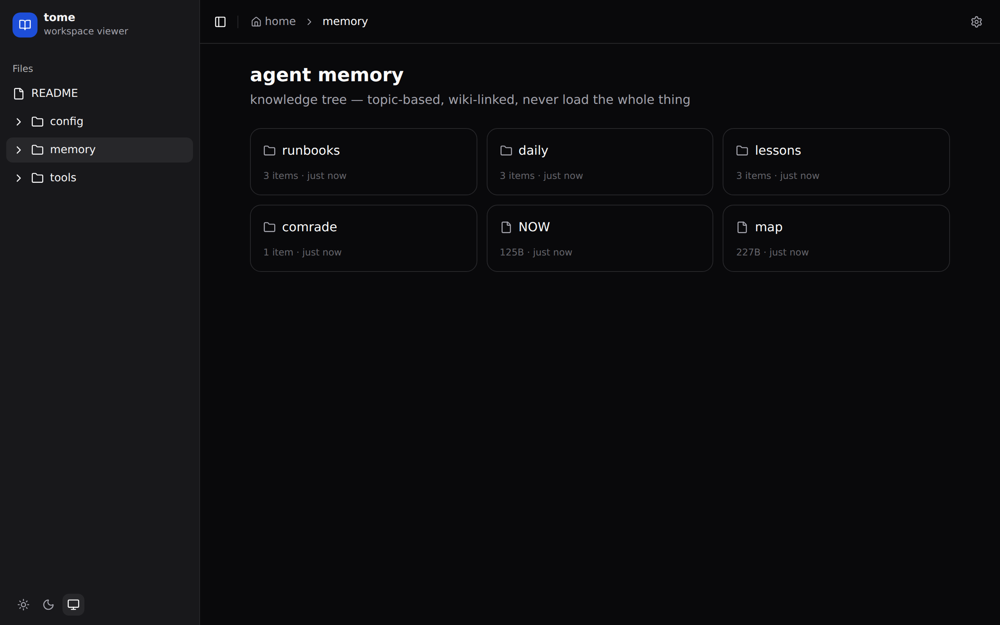
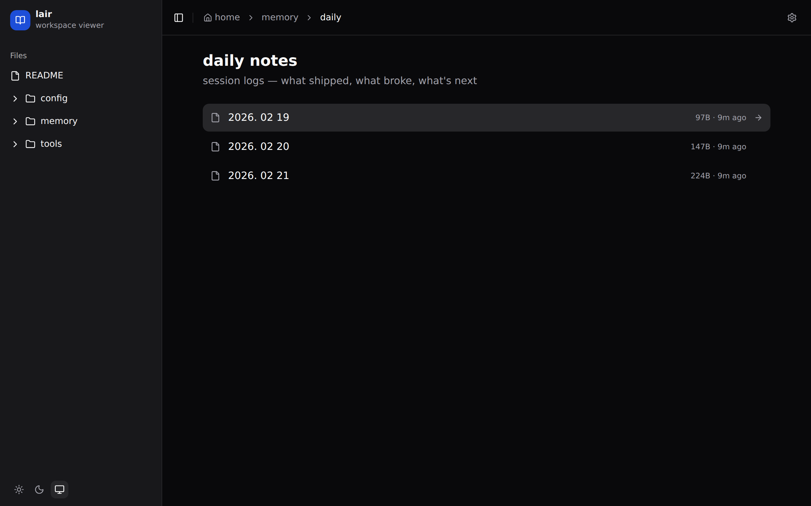
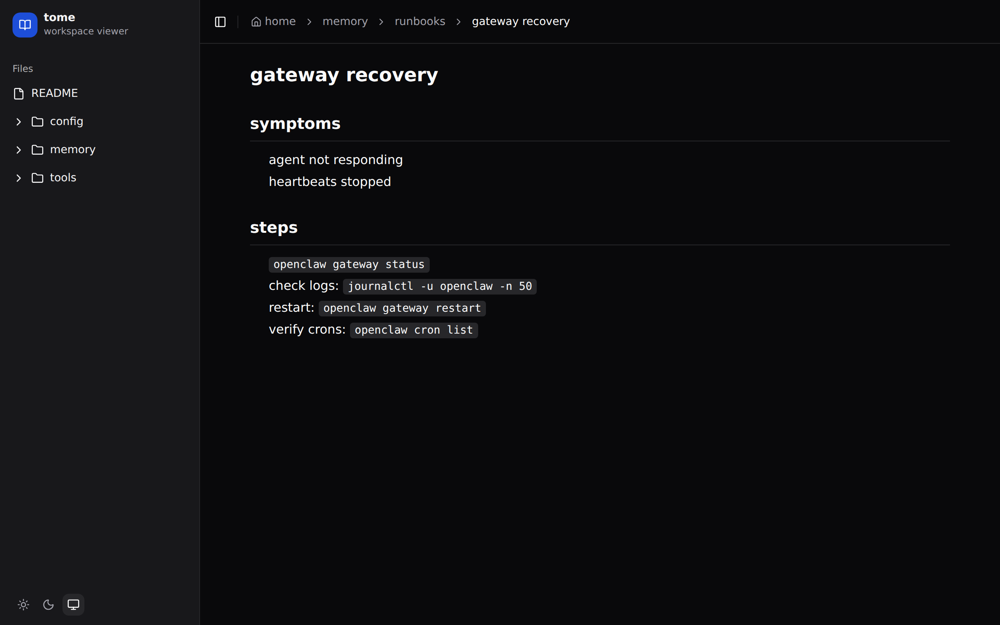
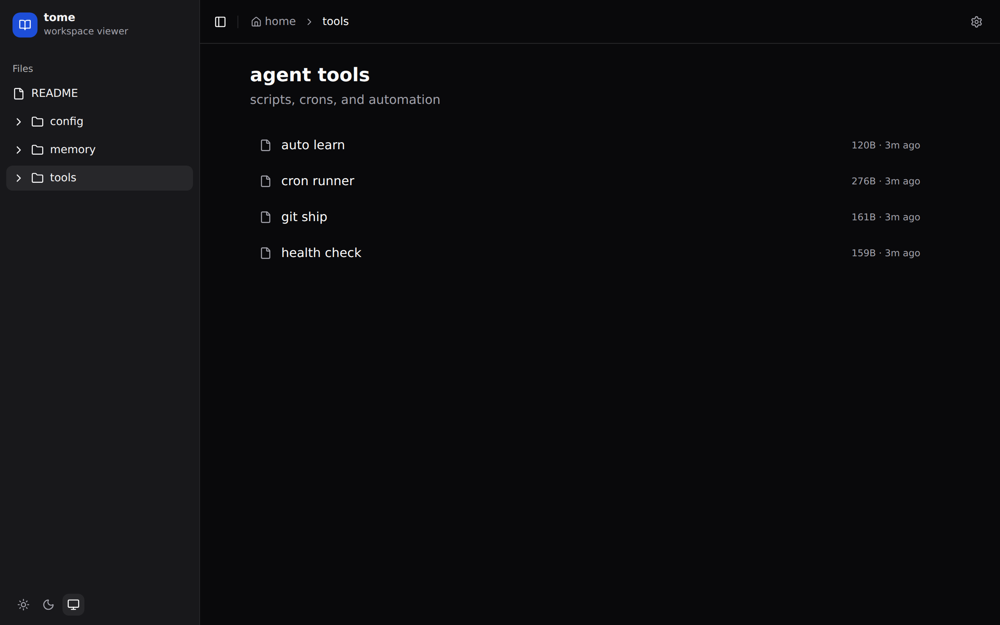

# tome

turn any folder into a browsable site. built for [openclaw](https://github.com/openclaw/openclaw) agent workspaces.



## why

openclaw agents accumulate knowledge: memory files, daily notes, runbooks, tool configs, lessons learned. tome makes that workspace browsable — for you and for the agent.

- **zero config** — `npx tome .` and you're done
- **live reload** — file changes appear instantly via websocket
- **per-folder config** — `.view.toml` to customize any directory
- **dark mode** — system, light, dark with toggle

## quick start

```bash
npx tome .                    # current directory
npx tome ~/.openclaw/workspace  # agent workspace
npx tome /var/www/docs        # any folder
```

## use cases

### agent workspace overview

give your workspace a title, switch to card layout, and tag your folders.

```toml
[header]
title = "maeve's workspace"
description = "memory, tools, crons, and configuration"
icon = "M"

[display]
layout = "cards"
columns = 2
showMeta = true

[pages."memory"]
badge = "core"
color = "#10b981"

[pages."tools"]
badge = "automation"
color = "#3b82f6"
```



### memory browser

browse the agent's knowledge tree. grid layout works well for folders with mixed content.

```toml
[header]
title = "agent memory"
description = "knowledge tree — topic-based, wiki-linked"

[display]
layout = "grid"
columns = 3
showMeta = true
sort = "modified"
```



### daily notes

session logs sorted by date. see what shipped, what broke, what's next.

```toml
[header]
title = "daily notes"
description = "session logs — what shipped, what broke, what's next"

[display]
layout = "list"
sort = "modified"
showMeta = true
```



### runbooks

rendered markdown with full formatting — headings, code blocks, step-by-step procedures.



### tools overview

table layout for quick scanning.

```toml
[header]
title = "agent tools"
description = "scripts, crons, and automation"

[display]
layout = "table"
sort = "name"
showMeta = true
```



## .view.toml reference

drop a `.view.toml` in any folder. or click the gear icon in the UI.

```toml
[header]
title = "my section"
description = "what this folder contains"
icon = "S"                    # single character

[display]
layout = "cards"              # list, cards, grid, table
sort = "modified"             # name, modified, created, size, type
columns = 3                   # for cards/grid
showMeta = true
groupBy = "type"              # none, type, ext, tag

[theme]
accent = "#3b82f6"
compact = false

[pages."README.md"]
title = "introduction"
badge = "start here"
color = "#10b981"
tags = ["docs", "getting-started"]
```

every option is live-editable via the gear icon. changes apply instantly.

## development

```bash
git clone https://github.com/safetnsr/tome
cd tome
bun install

bun run dev             # frontend on :5173
bun run dev:server      # api on :3333

bun run build
bun run start           # production on :3333
```

## tech

react 19 + shadcn/ui + tailwind v4 + hono + bun + websocket + chokidar + marked

## license

MIT
