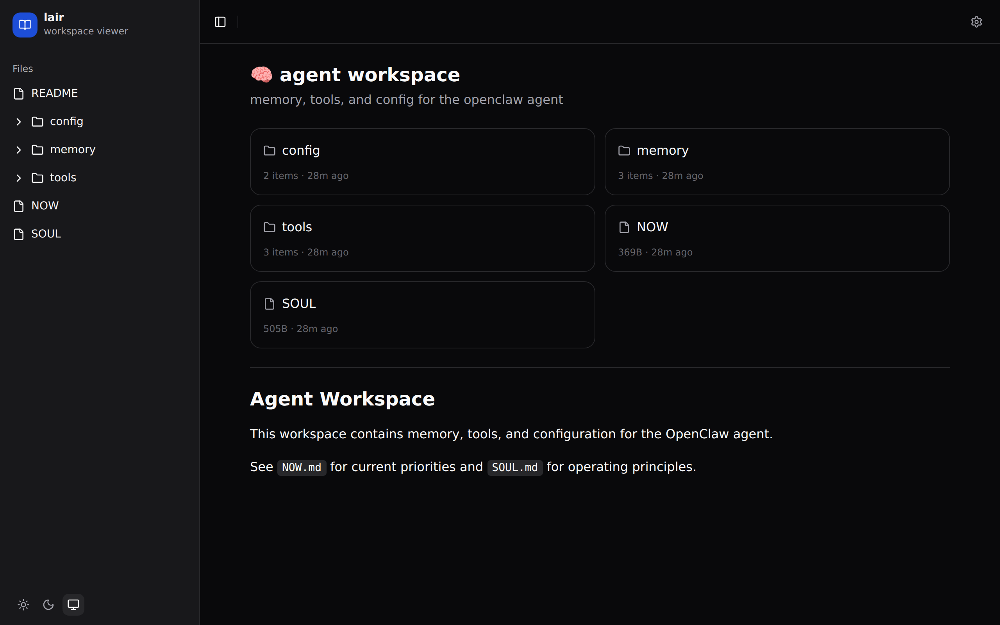
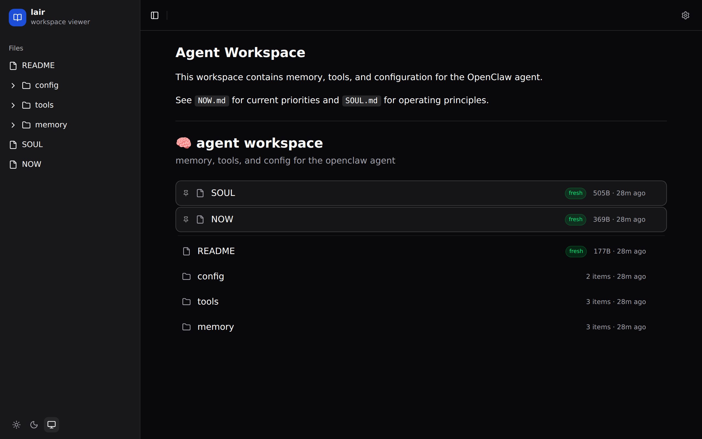
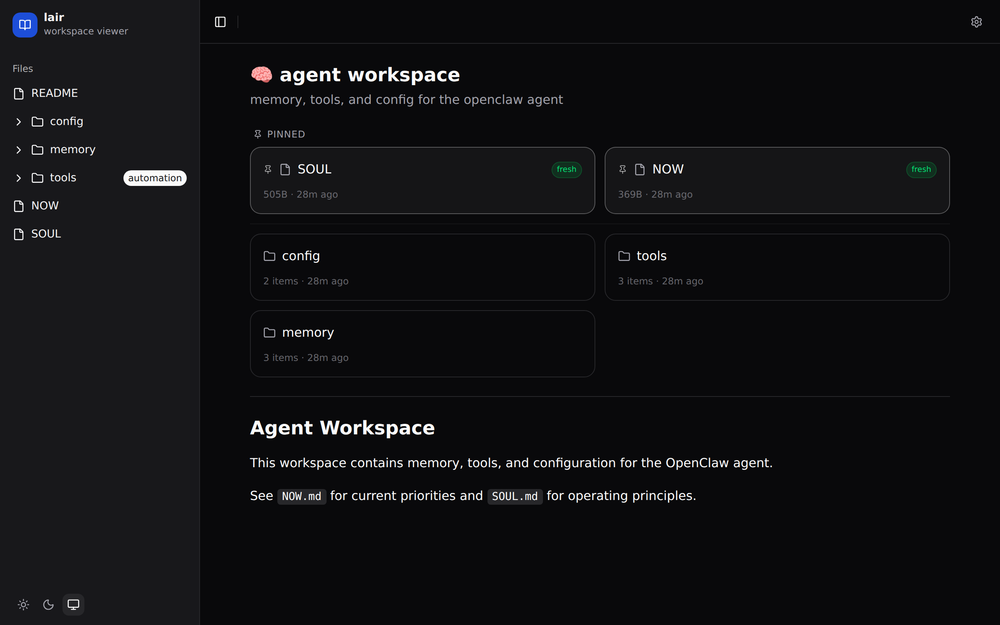

# lair

**turn any folder into a browsable workspace.** built for [openclaw](https://openclaw.com) agent workspaces.


---

## why lair?

- **see your agent's workspace** — markdown rendered, files browsable, real-time updates
- **zero config start** — point it at a directory, get a clean ui instantly
- **progressive config** — add a `.view.toml` to any folder to control layout, pins, embeds, and more
- **built for agents** — designed around how openclaw agents organize memory, tools, and config

## quick start

```bash
npx lair ~/workspace
```

open `http://localhost:3333`. that's it.

## zero config

with no `.view.toml`, lair gives you:

- file tree sidebar with collapsible folders
- markdown rendering for `.md` files
- file size and modification timestamps
- light/dark/system theme toggle
- real-time updates when files change


## your first `.view.toml`

drop a `.view.toml` in any directory to customize it. start simple:

```toml
[header]
title = "agent workspace"
description = "memory, tools, and config for the openclaw agent"
icon = "🧠"
```


each directory can have its own `.view.toml` — nest configs however you want.

## layouts

### cards

```toml
[display]
layout = "cards"
columns = 2
```



### grid

```toml
[display]
layout = "grid"
columns = 3
```


### list

```toml
[display]
layout = "list"
sort = "modified"
order = "desc"
```


## pin

pin important files to the top. they get a visual separator from the rest.

```toml
[pin]
files = ["NOW.md", "SOUL.md"]
```


## filter

control which files appear in a directory listing.

```toml
[filter]
hide = ["*.log", "draft/"]     # hide by name, extension, or glob
only = [".md", ".toml"]        # only show these extensions (directories always show)
```

patterns: `*.md` or `.md` for extensions, `drafts/` for directories, `secret.md` for exact names.

## status

show freshness badges based on file modification time.

```toml
[status]
fresh = "24h"    # modified within 24 hours → green "fresh" badge
stale = "7d"     # not modified for 7+ days → gray "stale" badge
```



duration format: `24h`, `7d`, `2w`, `1m` (hours, days, weeks, months).

## embed

inline file content directly in the directory listing.

```toml
[embed]
files = ["NOW.md"]
maxLines = 8           # truncate after n lines
collapsed = false      # start collapsed (click to expand)
```


## links

add external links to any directory listing.

```toml
[[links]]
title = "github"
url = "https://github.com/safetnsr"
icon = "🐙"

[[links]]
title = "api docs"
url = "https://api.comrade.md/docs"
icon = "📖"
```


## per-file styling

use `[pages]` to add badges, colors, tags, and descriptions to individual files:

```toml
[pages."NOW.md"]
badge = "active"
color = "#22c55e"
description = "current priorities and blockers"
tags = ["priority", "daily"]

[pages."SOUL.md"]
badge = "core"
color = "#8b5cf6"

[pages."memory/"]
description = "knowledge base and daily notes"
```



### page options

| option | type | description |
|--------|------|-------------|
| `title` | string | override display name |
| `icon` | string | emoji or icon |
| `description` | string | shown next to filename (list) or below (cards) |
| `badge` | string | small label badge |
| `color` | string | left border color (hex) |
| `tags` | string[] | tag badges (cards layout) |
| `order` | number | manual sort order |
| `pinned` | boolean | pin this file to top |
| `hidden` | boolean | hide from listing |
| `style` | string | `"highlight"`, `"hero"`, `"compact"`, `"full"`, `"raw"`, `"aside"` |
| `collapsed` | boolean | start directory collapsed in sidebar |
| `cover` | string | image path for cards layout |
| `redirect` | string | redirect to another path |

## full `.view.toml` reference

| section | key | type | default | description |
|---------|-----|------|---------|-------------|
| `[header]` | `title` | string | folder name | directory title |
| | `description` | string | — | subtitle below title |
| | `icon` | string | — | emoji before title |
| `[display]` | `layout` | string | `"list"` | `list`, `cards`, `grid` |
| | `sort` | string | `"name"` | `name`, `modified`, `created`, `size`, `type` |
| | `order` | string | `"asc"` | `asc`, `desc` |
| | `columns` | number | `3` | column count for cards/grid |
| | `showMeta` | boolean | `true` | show file size + modified date |
| `[pin]` | `files` | string[] | — | filenames to pin to top |
| `[filter]` | `hide` | string[] | — | patterns to hide |
| | `only` | string[] | — | only show matching files |
| `[status]` | `fresh` | string | — | duration for "fresh" badge |
| | `stale` | string | — | duration for "stale" badge |
| `[embed]` | `files` | string[] | — | files to embed inline |
| | `maxLines` | number | — | truncate embed after n lines |
| | `collapsed` | boolean | `false` | start embeds collapsed |
| `[[links]]` | `title` | string | — | link display text |
| | `url` | string | — | link url |
| | `icon` | string | — | emoji icon |
| `[pages."filename"]` | | | | see [per-file styling](#per-file-styling) |

## development

```bash
git clone https://github.com/safetnsr/lair
cd lair
bun install
bun run dev          # vite dev server (frontend)
bun run dev:server   # lair server (backend)
bun run build        # production build
```

requires [bun](https://bun.sh). stack: hono + react + tailwind + radix ui.

## license

mit
