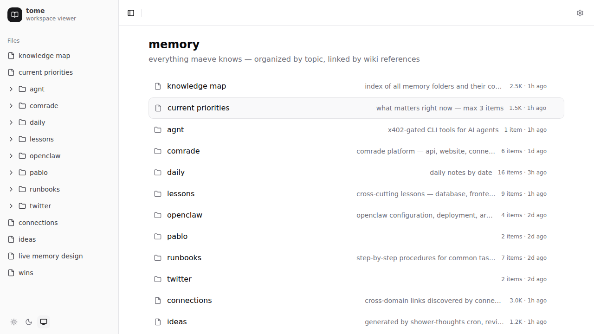

# tome

turn any folder into a browsable site. zero config, live, dark mode.





## features

- **zero config** — point at a folder, get a website
- **shadcn/ui** — collapsible sidebar, breadcrumbs, proper components
- **theme** — system, light, and dark mode with toggle
- **live reload** — WebSocket-powered, changes appear instantly
- **config editor** — gear icon on any directory to live-edit `.view.toml`
- **file types** — markdown, json, toml, yaml, code, images
- **`.view.toml`** — per-folder config for layout, sorting, theming, metadata

## quick start

```bash
npx tome .              # current directory
npx tome ~/notes        # any folder
npx tome /var/www/docs  # absolute path
```

## development

```bash
git clone https://github.com/safetnsr/tome
cd tome
bun install

# dev mode (vite + hot reload)
bun run dev             # frontend on :5173
bun run dev:server      # api on :3333

# production
bun run build
bun run start           # serves built SPA + API on :3333
```

## .view.toml

drop a `.view.toml` in any folder to configure it. or use the gear icon in the UI.

```toml
[header]
title = "my project"
description = "project documentation"
icon = "P"

[display]
layout = "cards"          # list, cards, grid, table, timeline
sort = "modified"         # name, modified, created, size, type, manual
columns = 3
showMeta = true
groupBy = "type"          # none, type, ext, tag

[theme]
accent = "#3b82f6"
compact = false

[pages."README.md"]
title = "introduction"
style = "hero"
badge = "start here"
color = "#10b981"
tags = ["docs", "getting-started"]
```

### visual config editor

click the gear icon (top-right) on any directory to open the live config editor:

- **visual mode** — buttons and toggles for layout, sort, theme, header
- **toml mode** — raw editor with validation
- **real-time** — changes apply instantly via WebSocket
- debounced saves (600ms) — type naturally, it saves

## tech stack

- **frontend**: react 19 + shadcn/ui + tailwind css v4
- **backend**: hono + bun
- **realtime**: websocket + chokidar file watcher
- **rendering**: marked (markdown), syntax highlighting (code)

## license

MIT
