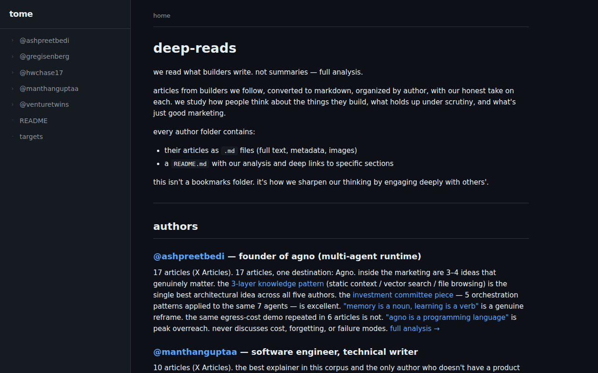

# tome

turn any folder into a browsable site. zero config, live, dark mode.

```bash
npx tome .
```



*with a `.view.toml` config:*


## what it does

point tome at a folder. it scans every file and directory, renders them as navigable pages, and serves a local website. no build step, no config required.

- **markdown** → rendered prose
- **json** → formatted tree
- **toml/yaml** → key-value display
- **code** → syntax highlighted
- **images** → inline gallery
- **directories** → auto-generated listings

## features

- zero config — just run it
- live updates — edits appear instantly
- dark mode — because obviously
- sidebar navigation — auto-generated from folder structure
- breadcrumbs — always know where you are
- smart defaults — `_about.md` or `README.md` becomes the landing page
- hidden files — dotfiles and `_` prefixed files hidden by default

## optional config

drop a `.view.toml` in any folder to customize how that folder renders. everything is optional — tome works without any config.

### display

```toml
[display]
layout = "cards"          # list | cards | grid | table | timeline
columns = 2              # for cards/grid layouts
sort = "modified"         # name | modified | created | size | type | manual
order = "desc"            # asc | desc
hidden = ["*.json", "archive/"]
pinned = ["NOW.md"]
showMeta = true           # show file size + modified date
showPreview = true        # show first lines of markdown files
previewLines = 3          # how many lines to preview
groupBy = "type"          # type | ext | tag | none
emptyMessage = "nothing here yet"
maxDepth = 3              # max recursion depth
showCount = true          # show child count on directories
```

### header

```toml
[header]
title = "deep reads"
description = "what builders write — full analysis, honest takes"
icon = "◈"
banner = "cover.png"      # image path relative to folder
```

### theme (per folder)

```toml
[theme]
accent = "#58a6ff"        # accent color
compact = true            # tighter spacing
```

### navigation

```toml
[nav]
expanded = true           # start expanded in sidebar
hidden = true             # hide from sidebar entirely
label = "docs"            # override name in sidebar
separator = "before"      # before | after | both
position = 1              # manual sidebar ordering
```

### per-page config

```toml
[pages."README.md"]
title = "overview"
style = "hero"            # highlight | compact | full | raw | hero | aside
description = "how we read, why we read"
badge = "new"
color = "#58a6ff"         # left border color
tags = ["agents", "memory"]
order = 1                 # manual sort order
pinned = true

[pages."@ashpreetbedi/"]
title = "@ashpreetbedi"
description = "agno founder — 17 articles"
badge = "17"
color = "#58a6ff"
tags = ["agents", "runtime"]
```

### aliases

```toml
[aliases]
intro = "README.md"
faq = "docs/frequently-asked.md"
```

### virtual pages

```toml
[[virtual]]
name = "changelog.md"
title = "changelog"
content = "## v0.1.0\n- initial release"
pinned = true
```

## use cases

- browse your openclaw workspace
- team knowledge base
- project documentation
- markdown wiki viewer
- any folder full of files you want to navigate

## install

```bash
# run directly
bunx tome /path/to/folder

# or install globally
bun add -g tome
tome /path/to/folder
```

## stack

bun + hono + marked. no react, no build step, no complexity.

## license

MIT
