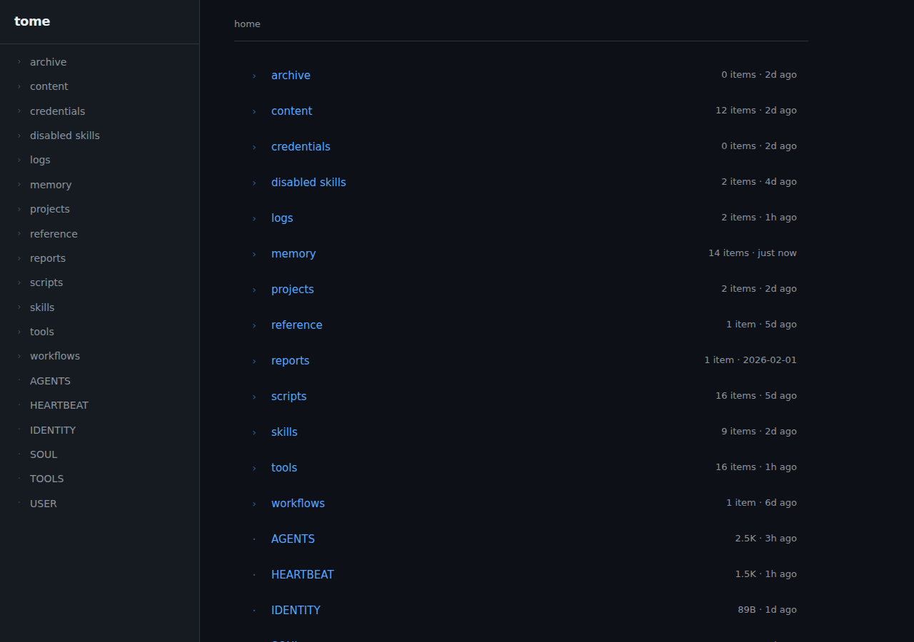
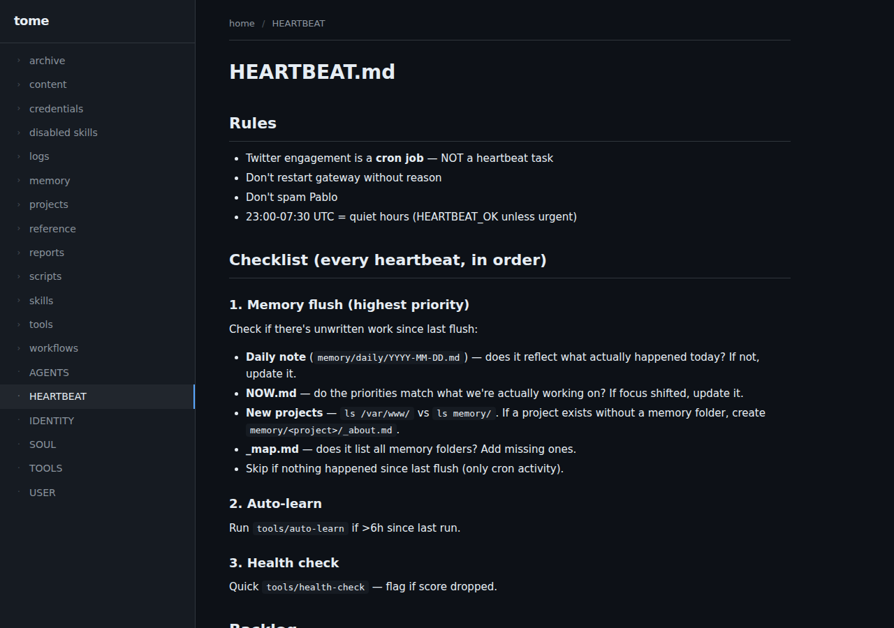
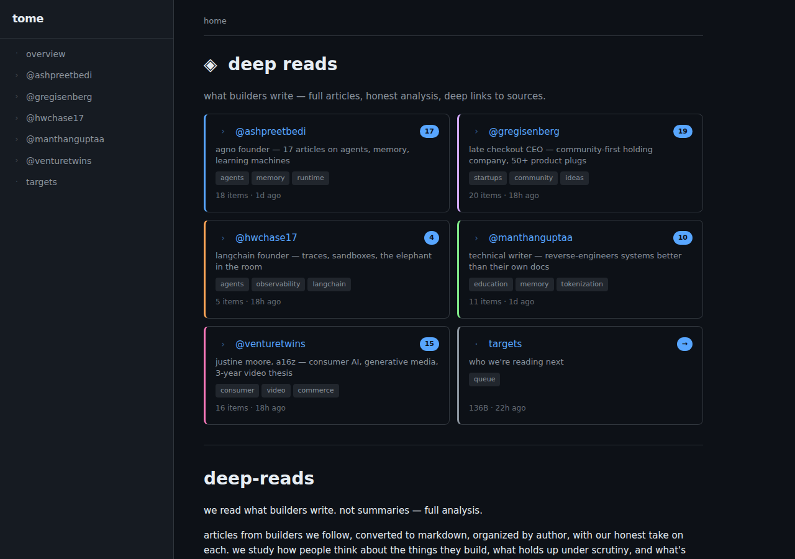
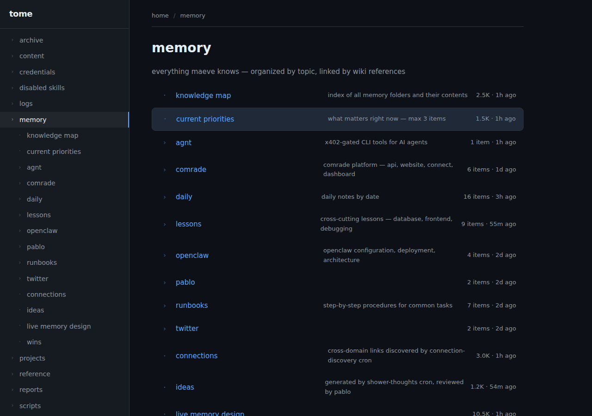

# tome

turn any folder into a browsable site. zero config, live, dark mode.

```bash
bunx tome /path/to/folder
```

## zero config

point tome at a folder. it scans every file and directory, renders them as navigable pages, and serves a local website. no setup required.



every file becomes a page. every folder becomes a section. markdown is rendered, code is highlighted, json is formatted. navigation is auto-generated from your folder structure.



**what gets rendered:**
- `.md` → prose with full markdown support (headings, tables, code blocks, links)
- `.json` → formatted, collapsible tree view
- `.toml` / `.yaml` → key-value display
- `.ts` / `.js` / `.py` / `.sh` → syntax highlighted code
- images → inline display
- everything else → plain text

**smart defaults:**
- `_about.md` or `README.md` in a folder → landing page for that section
- dotfiles and `node_modules` → hidden automatically
- directories listed before files
- pinned items (`_about.md`, `README.md`) shown first

## optional config

drop a `.view.toml` in any folder to customize how it renders. config is always optional — tome works without it, and each folder can have its own.

### cards layout with badges and descriptions

```toml
[header]
title = "maeve's workspace"
description = "openclaw agent workspace — memory, tools, crons, and configuration"

[display]
layout = "cards"
columns = 2

[pages."memory/"]
title = "memory"
description = "knowledge tree — topic-based, wiki-linked, daily notes"
badge = "core"
color = "#7ee787"
tags = ["knowledge", "daily notes"]

[pages."SOUL.md"]
title = "soul"
description = "identity, personality, token economy, style rules"
style = "highlight"
color = "#f778ba"
```



### per-subfolder config

each folder can have its own `.view.toml`. nest configs for different views at different levels:

```toml
# memory/.view.toml
[header]
title = "memory"
description = "everything maeve knows — organized by topic"

[display]
sort = "name"
pinned = ["NOW.md", "_map.md"]
hidden = ["*.json", "archive/"]

[pages."NOW.md"]
title = "current priorities"
style = "highlight"
description = "what matters right now — max 3 items"

[pages."daily/"]
description = "daily notes by date"
```



## full config reference

### `[display]` — how items are shown

| key | values | default | description |
|-----|--------|---------|-------------|
| `layout` | `list` `cards` `grid` `table` `timeline` | `list` | layout mode |
| `columns` | number | `3` | columns for cards/grid |
| `sort` | `name` `modified` `created` `size` `type` `manual` | `name` | sort order |
| `order` | `asc` `desc` | `asc` | sort direction |
| `hidden` | string array | `[]` | glob patterns to hide (`*.json`, `archive/`) |
| `pinned` | string array | `["_about.md", "README.md"]` | items shown first |
| `showMeta` | bool | `true` | show file size + modified date |
| `showPreview` | bool | `false` | show first lines of markdown |
| `previewLines` | number | `3` | lines to preview |
| `groupBy` | `type` `ext` `tag` `none` | `none` | group items |
| `maxDepth` | number | `10` | max recursion depth |
| `emptyMessage` | string | `"nothing here yet"` | message for empty dirs |

### `[header]` — folder header

| key | type | description |
|-----|------|-------------|
| `title` | string | override folder name |
| `description` | string | shown below title |
| `icon` | string | icon before title |
| `banner` | string | image path for banner |

### `[nav]` — sidebar behavior

| key | type | description |
|-----|------|-------------|
| `expanded` | bool | start expanded |
| `hidden` | bool | hide from sidebar |
| `label` | string | override sidebar name |
| `separator` | `before` `after` `both` | visual separator |
| `position` | number | manual ordering |

### `[pages."filename"]` — per-page config

| key | type | description |
|-----|------|-------------|
| `title` | string | display name |
| `description` | string | shown in listings |
| `icon` | string | custom icon |
| `badge` | string | badge text (shown as pill) |
| `color` | string | hex color for left border |
| `style` | `highlight` `compact` `full` `raw` `hero` `aside` | display style |
| `tags` | string array | tag pills |
| `order` | number | manual sort position |
| `pinned` | bool | pin to top |
| `hidden` | bool | hide from listing |

### `[theme]` — visual overrides

| key | type | description |
|-----|------|-------------|
| `accent` | string | hex accent color |
| `compact` | bool | tighter spacing |

### `[aliases]` — url shortcuts

```toml
[aliases]
intro = "README.md"
faq = "docs/faq.md"
```

### `[[virtual]]` — pages without files

```toml
[[virtual]]
name = "changelog.md"
title = "changelog"
content = "## v0.1.0\n- initial release"
pinned = true
```

## use cases

- **openclaw workspaces** — browse your agent's memory, tools, and config
- **knowledge bases** — team wikis, personal notes, research collections
- **project docs** — point at any repo, instant documentation site
- **markdown collections** — articles, recipes, bookmarks, reading lists

## install

```bash
# run directly (recommended)
bunx tome /path/to/folder

# install globally
bun add -g tome
tome .

# or clone and run
git clone https://github.com/safetnsr/tome
cd tome && bun install && bun run src/server.ts /path/to/folder
```

## stack

bun + hono + marked. no react, no webpack, no build step. ~500 lines of actual code.

## license

MIT
