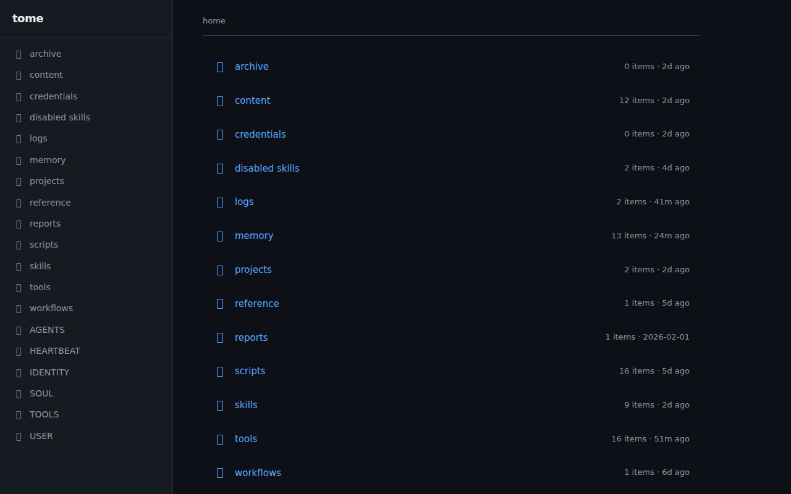
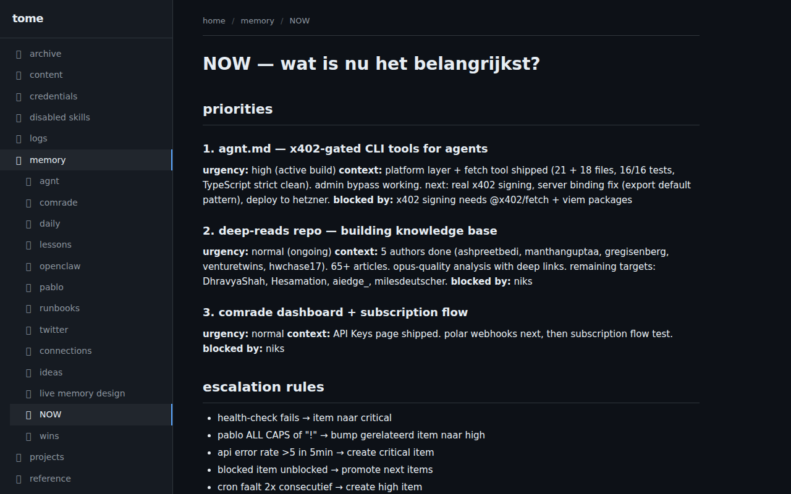
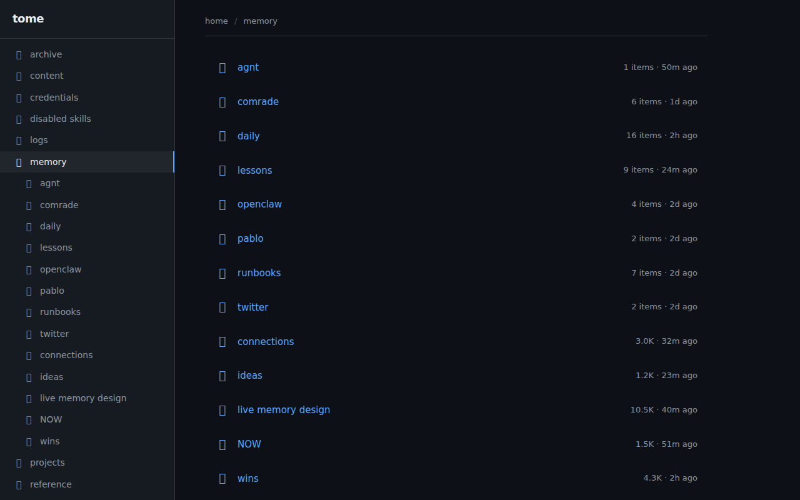

# tome

turn any folder into a browsable site. zero config, live, dark mode.

```bash
npx tome .
```

## screenshots





## what it does

point tome at a folder. it scans every file and directory, renders them as navigable pages, and serves a local website. no build step, no config required.

- **markdown** → rendered prose
- **json** → formatted tree
- **toml/yaml** → key-value display
- **code** → syntax highlighted
- **images** → inline gallery
- **directories** → auto-generated listings

## features

- zero config — just run it
- live updates — edits appear instantly
- dark mode — because obviously
- sidebar navigation — auto-generated from folder structure
- breadcrumbs — always know where you are
- smart defaults — `_about.md` or `README.md` becomes the landing page
- hidden files — dotfiles and `_` prefixed files hidden by default

## optional config

drop a `.view.toml` in any folder to customize:

```toml
[display]
layout = "cards"          # list | cards | table | timeline
sort = "modified"         # name | modified | created
hidden = ["*.json", "archive/"]
pinned = ["NOW.md"]

[pages."NOW.md"]
title = "current priorities"
icon = "🎯"
style = "highlight"
```

## use cases

- browse your openclaw workspace
- team knowledge base
- project documentation
- markdown wiki viewer
- any folder full of files you want to navigate

## install

```bash
# run directly
bunx tome /path/to/folder

# or install globally
bun add -g tome
tome /path/to/folder
```

## stack

bun + hono + marked. no react, no build step, no complexity.

## license

MIT
