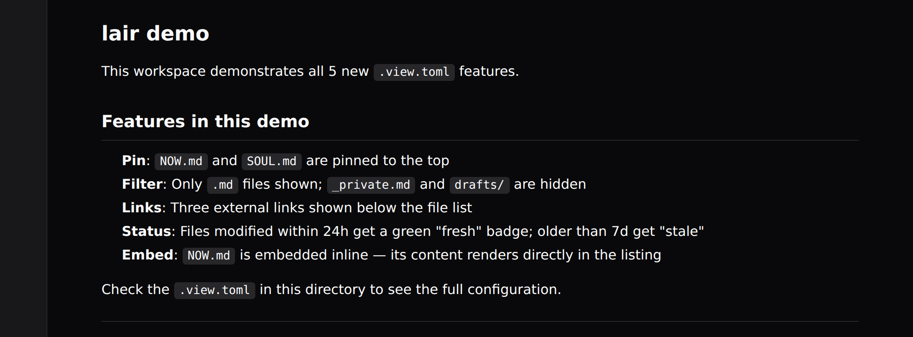
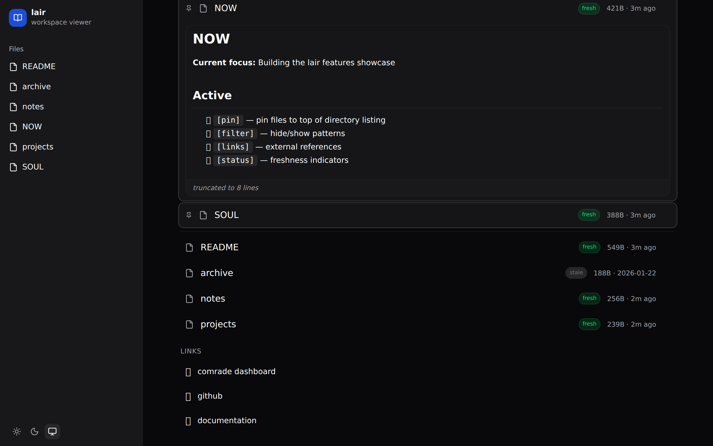
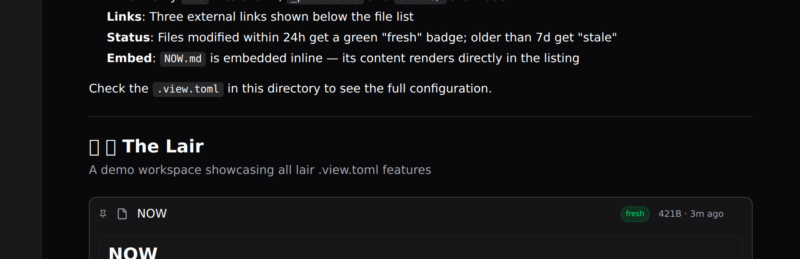
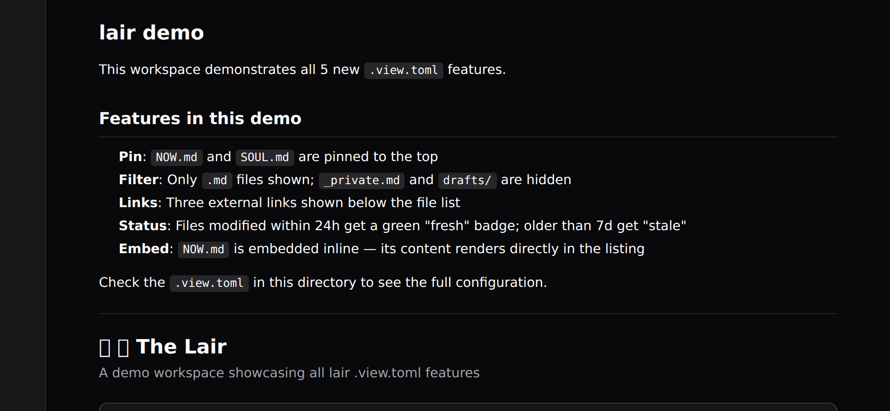

# lair

**A personal workspace viewer for local files.** Point lair at any directory and get a clean, configurable web UI — with real-time updates, markdown rendering, and powerful per-directory `.view.toml` configuration.


---

## What is lair?

lair serves your local files as a read/write wiki-style interface. It's built for personal knowledge bases, project workspaces, and agentic memory systems. Every directory can have its own `.view.toml` to control layout, appearance, and behavior.

---

## Quick start

```bash
# Install
bun install

# Build
bun run build

# Run (point at any directory)
bun run start ~/workspace
bun run start /var/www/myproject
bun run start .       # current directory
```

Then open `http://localhost:3333` in your browser.

---

## `.view.toml` — configuration reference

Each directory can have a `.view.toml` file that controls how lair renders it. All fields are optional.

### `[display]` — layout and sorting

```toml
[display]
layout = "list"        # list | cards | grid | table | timeline
sort = "name"          # name | modified | created | size | type
order = "asc"          # asc | desc
columns = 3            # for cards/grid layouts
showMeta = true        # show file size + modified date
showPreview = false    # show first lines of markdown files
previewLines = 3       # how many lines to preview
groupBy = "none"       # type | ext | tag | none
emptyMessage = "nothing here yet"
maxDepth = 5           # max recursion depth for sidebar
showCount = true       # show child count on directories
hidden = ["drafts", "*.tmp"]  # hide by name or glob
pinned = ["README.md"]        # pin specific files to top (legacy)
```

### `[header]` — directory header

```toml
[header]
title = "My Workspace"
description = "A brief description shown below the title"
icon = "🦇"
banner = "banner.png"  # image path relative to directory
```

### `[theme]` — visual overrides

```toml
[theme]
accent = "#10b981"     # hex color for accent elements
bg = "#0a0a0a"         # background color override
font = "JetBrains Mono"
borderRadius = "12px"
compact = true         # tighter spacing
```

### `[nav]` — sidebar behavior

```toml
[nav]
expanded = true        # start expanded in sidebar
hidden = false         # hide from sidebar entirely
label = "My Docs"      # override name in sidebar
icon = "📚"
separator = "before"   # before | after | both
position = 1           # manual sidebar ordering
```

### `[pages]` — per-file metadata

```toml
[pages."README.md"]
title = "About this project"
description = "What this directory contains"
badge = "core"
color = "#10b981"
icon = "🏠"
order = 1
style = "hero"         # highlight | compact | full | raw | hero | aside
tags = ["docs", "pinned"]

[pages."archive/"]
badge = "old"
color = "#6b7280"
```

---

## New features (v2)

### 1. `[pin]` — pin files to top

Pin specific files so they always appear at the top of directory listings, visually separated from the rest.

```toml
[pin]
files = ["NOW.md", "SOUL.md"]
```



**How it works:**
- Pinned files are moved to the top of the listing, regardless of sort order
- They get a subtle pin (📌) indicator icon
- A visual separator divides pinned items from the rest
- Works in all layouts: list, cards, grid, table
- In cards layout, pinned files get their own "PINNED" section with a heading

**Example:** If you have a `NOW.md` (what you're working on) and a `SOUL.md` (principles/context), pin them so they're always immediately visible when you open the directory.

---

### 2. `[filter]` — hide/show patterns

Control exactly which files appear in directory listings and the sidebar.

```toml
[filter]
hide = ["_about.md", ".credentials", "archive", "drafts"]
only = [".md"]
```

**Options:**

| Option | Type | Description |
|--------|------|-------------|
| `hide` | `string[]` | Patterns to exclude from listing |
| `only` | `string[]` | If set, only show files matching these extensions |

**Pattern matching:**
- `.md` — match any file with `.md` extension
- `*.log` — glob: match any file ending in `.log`
- `archive` — exact name match (directory or file)
- `archive/` — explicit directory match

**Notes:**
- Directories always pass the `only` filter (so you can still navigate subdirectories)
- `hide` takes precedence over `only`
- Filtered files disappear from both the main listing **and** the sidebar
- The built-in hidden patterns (dotfiles, `node_modules`, `dist`) apply on top

**Example:** In a workspace with code, notes, and private files:
```toml
[filter]
hide = ["_private", "node_modules", "dist"]
only = [".md"]  # only show markdown in the listing
```

---

### 3. `[links]` — external references

Add external links as a dedicated section in the directory listing. Links render as clickable items that open in a new tab.

```toml
[[links]]
title = "comrade dashboard"
url = "https://comrade.md"
icon = "📊"

[[links]]
title = "github"
url = "https://github.com/safetnsr/lair"
icon = "🔗"

[[links]]
title = "documentation"
url = "https://github.com/safetnsr/lair#readme"
icon = "📖"
```



**Options per link:**

| Field | Type | Required | Description |
|-------|------|----------|-------------|
| `title` | `string` | ✅ | Display name for the link |
| `url` | `string` | ✅ | URL to open (in new tab) |
| `icon` | `string` | — | Emoji or character to display |

**Layout behavior:**
- In **list layout**: links appear as a "LINKS" section below the file list, styled distinctly from files
- In **cards/grid layout**: links render as dashed-border cards in their own grid section
- Links always open in a new tab (`target="_blank"`)
- If no icon is provided, an external link icon is shown instead

---

### 4. `[status]` — freshness indicators

Automatically badge files based on how recently they were modified.

```toml
[status]
fresh = "24h"   # files modified within 24h get a green "fresh" badge
stale = "7d"    # files not modified in 7+ days get a dim "stale" badge
```



**Duration format:**
| Suffix | Meaning |
|--------|---------|
| `h` | hours |
| `d` | days |
| `w` | weeks |
| `m` | months (30d) |

**Examples:** `"1h"`, `"24h"`, `"3d"`, `"7d"`, `"2w"`, `"30d"`

**Behavior:**
- `fresh` badge: green pill, appears on files modified within the specified duration
- `stale` badge: dim gray pill, appears on files not modified since the duration
- Both can be set simultaneously — `fresh` takes precedence if both would match
- Only applies to files, not directories
- Badges appear next to the filename in all layouts (list, cards, grid)

**Use cases:**
- Track "active" notes vs. abandoned ones
- Highlight recently updated docs in a knowledge base
- Surface stale tasks that need attention

---

### 5. `[embed]` — inline file preview

Render file contents directly inline in the directory listing, without needing to click into the file.

```toml
[embed]
files = ["NOW.md", "CONTEXT.md"]
maxLines = 10
collapsed = false
```



**Options:**

| Field | Type | Default | Description |
|-------|------|---------|-------------|
| `files` | `string[]` | — | List of filenames to embed |
| `maxLines` | `number` | — | Truncate after N HTML lines (shows truncation notice) |
| `collapsed` | `boolean` | `false` | If true, shows as collapsible section (closed by default) |

**Behavior:**
- Embedded files render their full markdown HTML inline in the listing
- The file still appears as a normal item in its position (pinned if also in `[pin]`)
- `maxLines`: truncate the rendered HTML after N lines, with an italic "truncated to N lines" notice at the bottom
- `collapsed = true`: shows a "preview" toggle button; content is hidden until expanded
- Clicking the embedded content area does not navigate — only clicking the file name/button does

**Cards layout:** Embed previews render as a bordered preview section inside the card.

**Example use case:**
```toml
[pin]
files = ["NOW.md"]

[embed]
files = ["NOW.md"]
maxLines = 15
collapsed = false
```
This pins `NOW.md` to the top and shows its content inline — perfect for a "current status" that's always visible on the workspace landing page.

---

## Cards layout with all features


In cards layout, all 5 features work together:
- Pinned files get a dedicated "PINNED" section at the top
- Status badges (fresh/stale) appear on each card
- Embedded content renders inside the card body
- Links appear as dashed-border cards in a "LINKS" grid section
- Filtered files are hidden completely

---

## Full demo `.view.toml`

This is the config used in the screenshot above — showcasing all 5 features:

```toml
[header]
title = "🦇 The Lair"
description = "A demo workspace showcasing all lair .view.toml features"
icon = "🦇"

[display]
layout = "list"
showMeta = true

[pin]
files = ["NOW.md", "SOUL.md"]

[filter]
hide = ["_private.md", "drafts"]
only = [".md"]

[status]
stale = "7d"
fresh = "24h"

[embed]
files = ["NOW.md"]
maxLines = 8
collapsed = false

[[links]]
title = "comrade dashboard"
url = "https://comrade.md"
icon = "📊"

[[links]]
title = "github"
url = "https://github.com/safetnsr/lair"
icon = "🔗"

[[links]]
title = "documentation"
url = "https://github.com/safetnsr/lair#readme"
icon = "📖"
```

---

## Architecture

```
lair/
├── src/
│   ├── server/
│   │   ├── index.ts       # Hono API server + WebSocket
│   │   ├── scanner.ts     # File tree scanner + all feature processors
│   │   └── renderer.ts    # Markdown/code/image rendering
│   └── client/
│       ├── App.tsx                           # Root component
│       ├── types.ts                          # Shared TypeScript types
│       ├── components/
│       │   ├── directory-listing.tsx         # All 5 new features rendered here
│       │   ├── app-sidebar.tsx               # Sidebar (respects [filter])
│       │   ├── file-viewer.tsx               # File content viewer
│       │   └── config-editor.tsx             # In-app TOML editor
│       └── hooks/
│           └── use-tome.ts                   # Data fetching hooks
└── dist/                  # Built SPA assets
```

**Server features:**
- Bun + Hono HTTP server
- Real-time WebSocket refresh (chokidar file watcher)
- In-memory file tree with 5s refresh interval
- All feature processing (filter, pin, status, embed) on the server
- In-app TOML editor via `PUT /api/config/*`

**Client features:**
- React SPA with Vite build
- Dark/light/system theme toggle
- Shadcn/ui components
- Hash-based routing (`#path/to/file`)

---

## API

| Method | Path | Description |
|--------|------|-------------|
| `GET` | `/api/tree` | Full file tree |
| `GET` | `/api/content/*` | File or directory content (with all features applied) |
| `GET` | `/api/config/*` | Raw TOML + parsed config for a directory |
| `PUT` | `/api/config/*` | Save TOML config (validates before writing) |
| `GET` | `/raw/*` | Serve raw files (images, downloads) |
| `WS` | `/ws` | Real-time refresh notifications |

### Content response for directories

```json
{
  "type": "directory",
  "path": "some/path",
  "config": { ... },
  "landingHtml": "<h1>...</h1>",
  "children": [
    {
      "name": "NOW.md",
      "path": "NOW.md",
      "type": "file",
      "ext": ".md",
      "size": 421,
      "modified": "2026-02-21T10:37:29.473Z",
      "meta": {},
      "embedHtml": "<h1>NOW</h1><p>...</p>",
      "isPinned": true,
      "statusBadge": "fresh"
    }
  ]
}
```

New fields added to each child node:
- `embedHtml` — rendered HTML string (only present if file is in `[embed].files`)
- `isPinned` — boolean, true if file is in `[pin].files`
- `statusBadge` — `"fresh"` | `"stale"` | `null` based on `[status]` config

---

## Development

```bash
# Install dependencies
bun install

# Dev mode (client only, with HMR)
bun run dev

# Build production assets
bun run build

# Run production server
bun run start /path/to/workspace

# Type check
npx tsc --noEmit
```

---

## License

MIT
