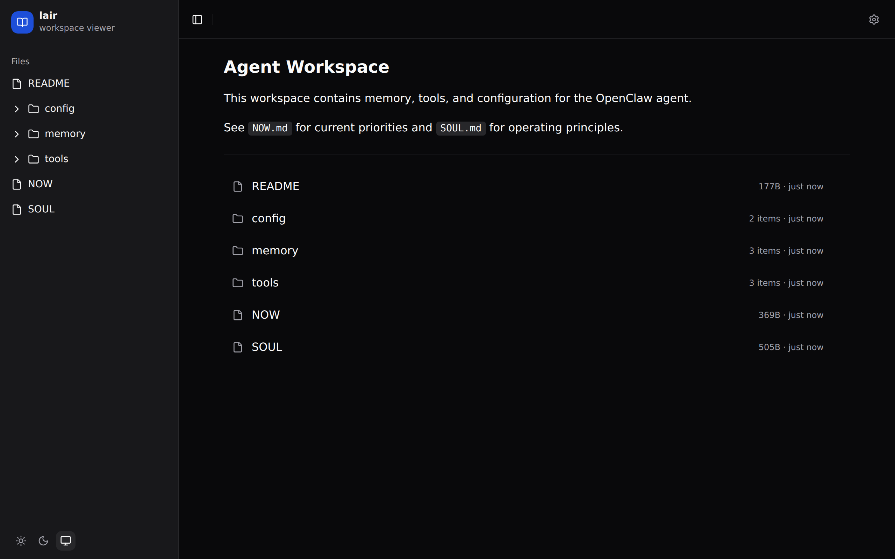
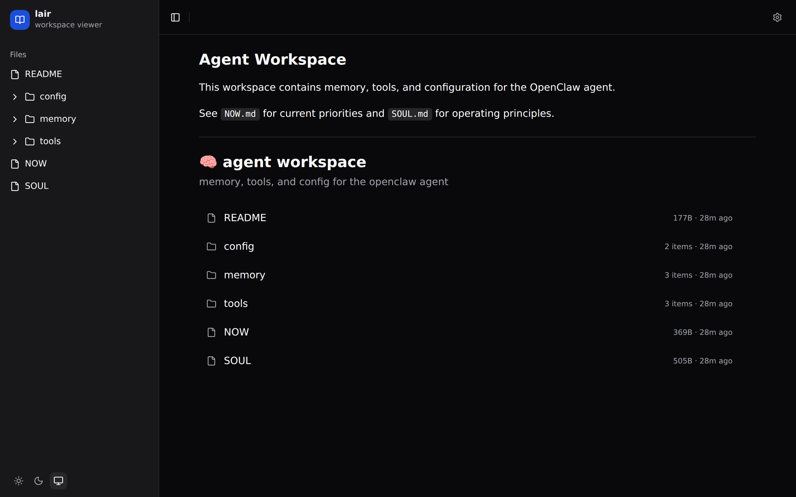
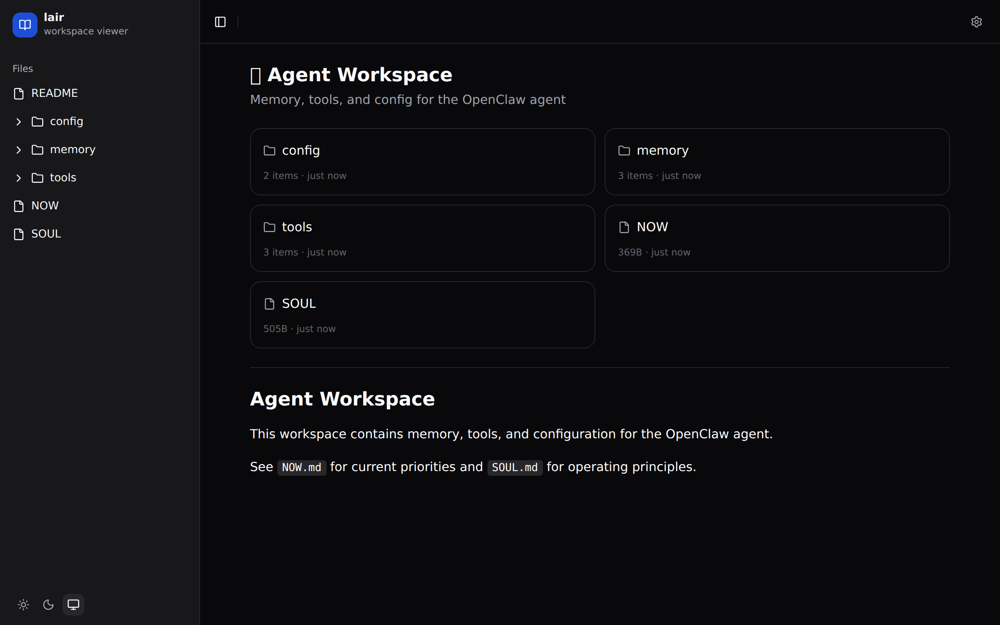
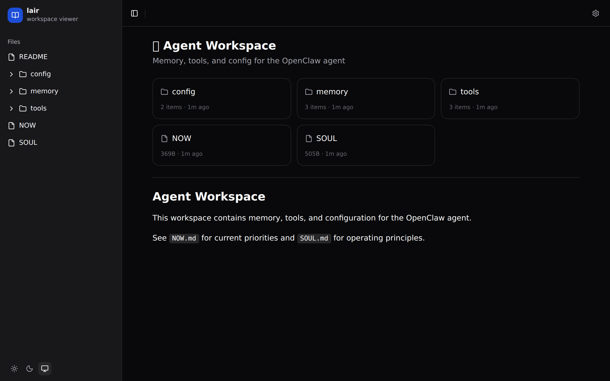
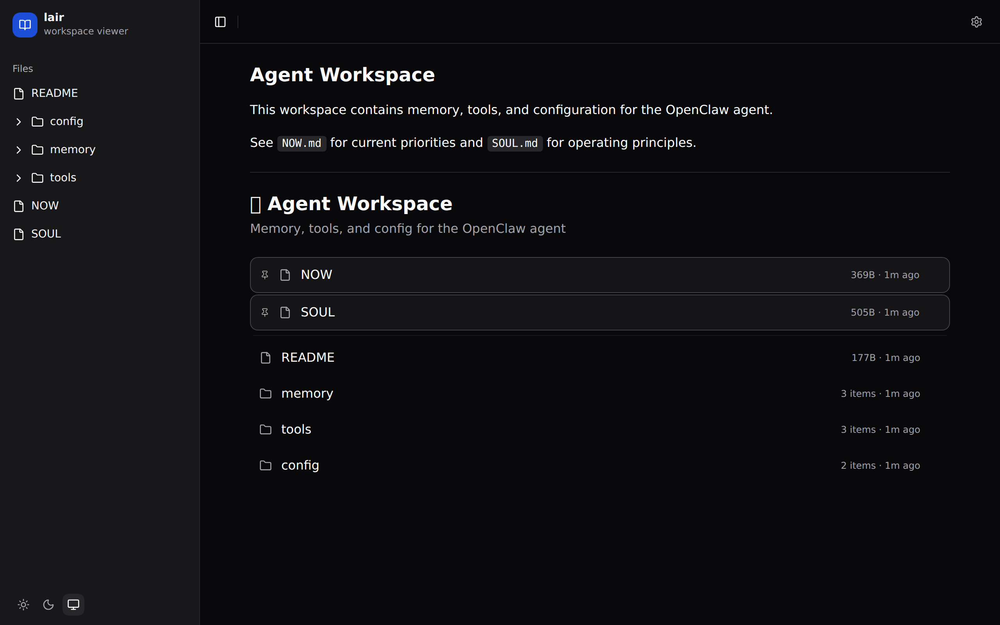
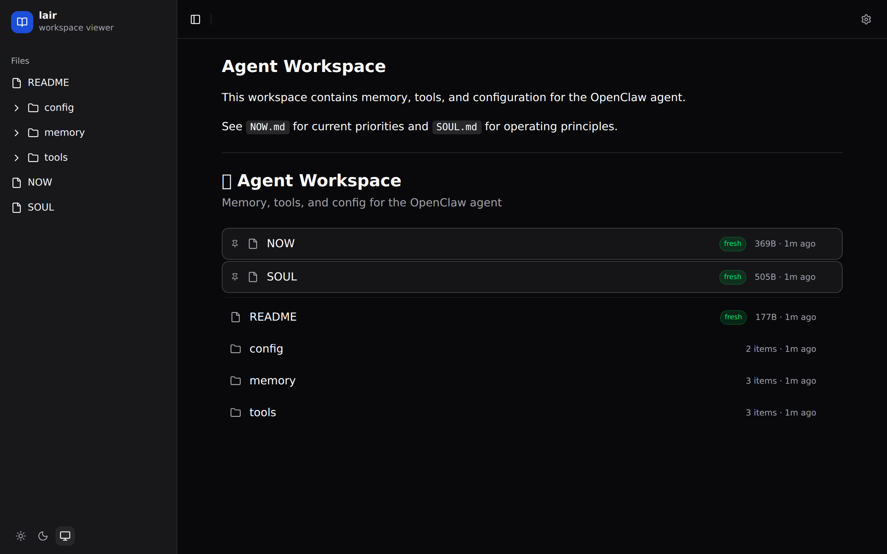
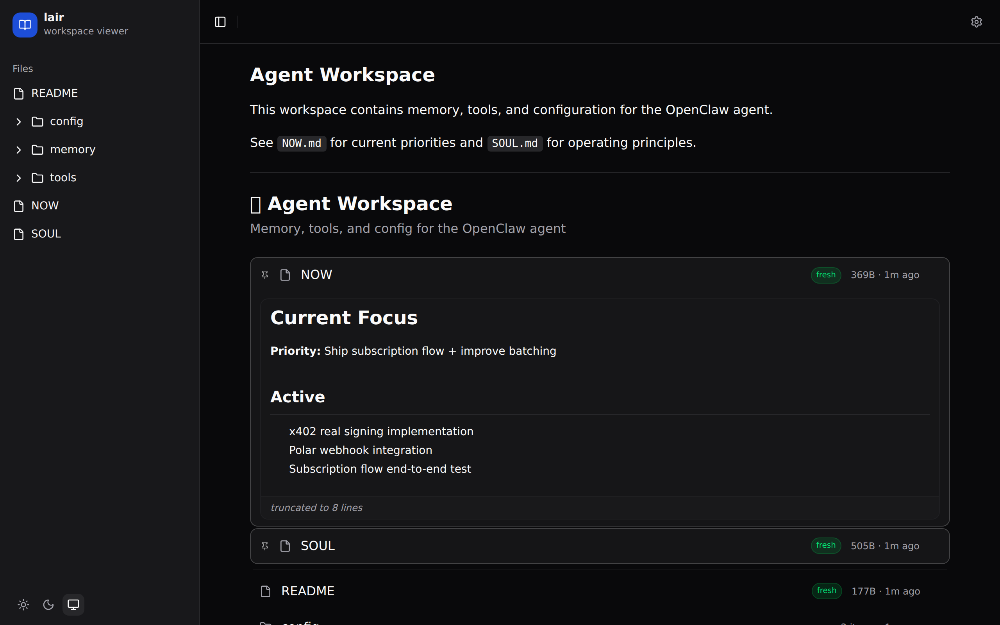
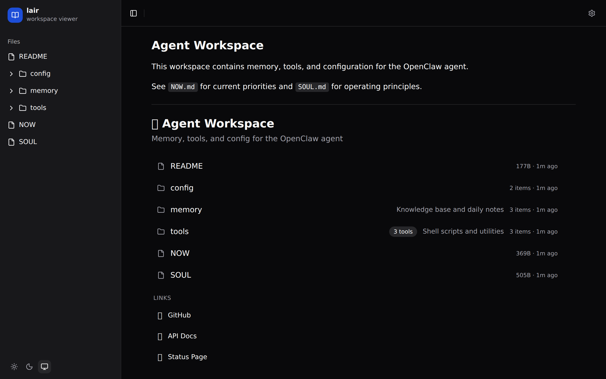
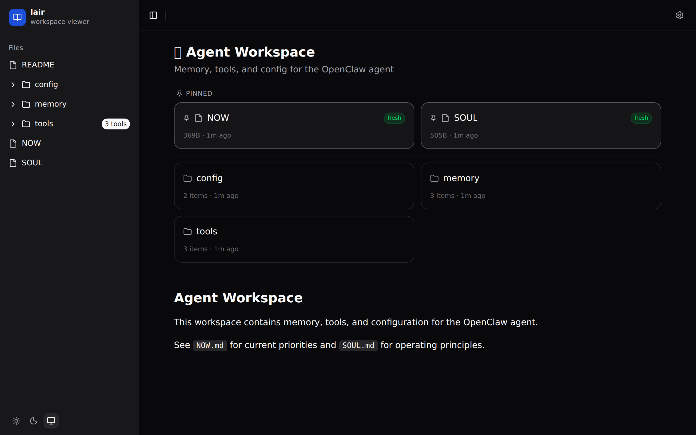

# lair

**Turn any folder into a browsable workspace.** Built for [OpenClaw](https://openclaw.com) agent workspaces.



---

## Why lair?

- **See your agent's workspace** — markdown rendered, files browsable, real-time updates
- **Zero config start** — point it at a directory, get a clean UI instantly
- **Progressive config** — add a `.view.toml` to any folder to control layout, pins, embeds, and more
- **Built for agents** — designed around how OpenClaw agents organize memory, tools, and config

## Quick start

```bash
npx lair ~/workspace
```

Open `http://localhost:3333`. That's it.

## Zero config

With no `.view.toml`, lair gives you:

- File tree sidebar with collapsible folders
- Markdown rendering for `.md` files
- File size and modification timestamps
- Light/dark/system theme toggle
- Real-time updates when files change


## Your first `.view.toml`

Drop a `.view.toml` in any directory to customize it. Start simple:

```toml
[header]
title = "Agent Workspace"
description = "Memory, tools, and config for the OpenClaw agent"
icon = "🧠"
```



Each directory can have its own `.view.toml` — nest configs however you want.

## Layouts

### Cards

```toml
[display]
layout = "cards"
columns = 2
```



### Grid

```toml
[display]
layout = "grid"
columns = 3
```



### List

```toml
[display]
layout = "list"
sort = "modified"
order = "desc"
```


## Pin

Pin important files to the top. They get a visual separator from the rest.

```toml
[pin]
files = ["NOW.md", "SOUL.md"]
```



## Filter

Control which files appear in a directory listing.

```toml
[filter]
hide = ["*.log", "draft/"]     # hide by name, extension, or glob
only = [".md", ".toml"]        # only show these extensions (directories always show)
```

Patterns: `*.md` or `.md` for extensions, `drafts/` for directories, `SECRET.md` for exact names.

## Status

Show freshness badges based on file modification time.

```toml
[status]
fresh = "24h"    # modified within 24 hours → green "fresh" badge
stale = "7d"     # not modified for 7+ days → gray "stale" badge
```



Duration format: `24h`, `7d`, `2w`, `1m` (hours, days, weeks, months).

## Embed

Inline file content directly in the directory listing.

```toml
[embed]
files = ["NOW.md"]
maxLines = 8           # truncate after N lines
collapsed = false      # start collapsed (click to expand)
```



## Links

Add external links to any directory listing.

```toml
[[links]]
title = "GitHub"
url = "https://github.com/safetnsr"
icon = "🐙"

[[links]]
title = "API Docs"
url = "https://api.comrade.md/docs"
icon = "📖"
```



## Per-file styling

Use `[pages]` to add badges, colors, tags, and descriptions to individual files:

```toml
[pages."NOW.md"]
badge = "active"
color = "#22c55e"
description = "Current priorities and blockers"
tags = ["priority", "daily"]

[pages."SOUL.md"]
badge = "core"
color = "#8b5cf6"

[pages."memory/"]
description = "Knowledge base and daily notes"
```



### Page options

| Option | Type | Description |
|--------|------|-------------|
| `title` | string | Override display name |
| `icon` | string | Emoji or icon |
| `description` | string | Shown next to filename (list) or below (cards) |
| `badge` | string | Small label badge |
| `color` | string | Left border color (hex) |
| `tags` | string[] | Tag badges (cards layout) |
| `order` | number | Manual sort order |
| `pinned` | boolean | Pin this file to top |
| `hidden` | boolean | Hide from listing |
| `style` | string | `"highlight"`, `"hero"`, `"compact"`, `"full"`, `"raw"`, `"aside"` |
| `collapsed` | boolean | Start directory collapsed in sidebar |
| `cover` | string | Image path for cards layout |
| `redirect` | string | Redirect to another path |

## Full `.view.toml` reference

| Section | Key | Type | Default | Description |
|---------|-----|------|---------|-------------|
| `[header]` | `title` | string | folder name | Directory title |
| | `description` | string | — | Subtitle below title |
| | `icon` | string | — | Emoji before title |
| `[display]` | `layout` | string | `"list"` | `list`, `cards`, `grid` |
| | `sort` | string | `"name"` | `name`, `modified`, `created`, `size`, `type` |
| | `order` | string | `"asc"` | `asc`, `desc` |
| | `columns` | number | `3` | Column count for cards/grid |
| | `showMeta` | boolean | `true` | Show file size + modified date |
| `[pin]` | `files` | string[] | — | Filenames to pin to top |
| `[filter]` | `hide` | string[] | — | Patterns to hide |
| | `only` | string[] | — | Only show matching files |
| `[status]` | `fresh` | string | — | Duration for "fresh" badge |
| | `stale` | string | — | Duration for "stale" badge |
| `[embed]` | `files` | string[] | — | Files to embed inline |
| | `maxLines` | number | — | Truncate embed after N lines |
| | `collapsed` | boolean | `false` | Start embeds collapsed |
| `[[links]]` | `title` | string | — | Link display text |
| | `url` | string | — | Link URL |
| | `icon` | string | — | Emoji icon |
| `[pages."filename"]` | | | | See [per-file styling](#per-file-styling) |

## Development

```bash
git clone https://github.com/safetnsr/lair
cd lair
bun install
bun run dev          # vite dev server (frontend)
bun run dev:server   # lair server (backend)
bun run build        # production build
```

Requires [Bun](https://bun.sh). Stack: Hono + React + Tailwind + Radix UI.

## License

MIT
